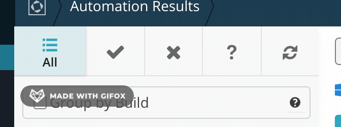
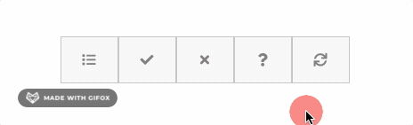

# Icon Menu
A menu of icons with revealing text and containers that grow on hover. Inspired by the following menu from a popular automation testing web app:

**Source**

**End Product**

## My Approach
I knew I wanted containers with equal dimensions, so first I reached for CSS Grid and created columns of equal widths. When it was time to expand my columns on hover, I realized that Grid would not be the simplest solution. At that point I swapped out grid for Flexbox, since I was only laying out content in one dimension and the `flex` property would help me achieve exactly what I wanted when hovering.

## Challenges
I was positioning some text outside each container, then bringing it back to its original position on hover. Before turning to opacity, I tried to show and reveal the text using `display: none;` and `display: block;`. I wanted some subtlety to the text disappearing and reappearing, but I quickly learned there is no subtlety to be had because the `display` property cannot be animated.

I then chose to use `opacity` to hide and reveal my content, then I added an animation to achieve much sought-after subtlety. That worked, but there was still one issue: due to the animation delay, the text was not disappearing until after it was outside the container. After some experimentation, I realized I could use `overflow: hidden` to hide even positioned text rendering outside the element. Another tool in my utility belt!

Things were looking good now, but there was still some jittery behavior when I hovered directly on the text mid-animation. I was curious if, using CSS, I could ignore hover events on an element. Luckily a declaration of `pointer-events: none;` is perfect for this use case.

## Conclusion
Although this was a rather simple project, I actually learned quite a few things. I took some of the techniques here and implemented them in my [CSS Accordion](https://github.com/alex-j-garcia/css-accordion) and it made a considerable difference in the quality of that component. I also realized that I'm not as comfortable with Flexbox as I thought I was, so I'll be diving back into that topic soon.
